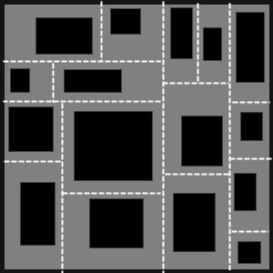

# Basic BSP Dungeon generation

---

## A simple method to generate a basic dungeon using a bsp tree

---

### Building the BSP

We start with a rectangular dungeon filled with wall cells. We are going to split this dungeon recursively until each sub-dungeon has approximately the size of a room. The dungeon splitting uses this operation :  

* choose a random direction : horizontal or vertical splitting
* choose a random position (x for vertical, y for horizontal)
* split the dungeon into two sub-dungeons  

**The first splitting iteration**  
  

Now we have two sub-dungeons A and B. We can apply the same operation to both of them :  

**The second splitting iteration**  
  

When choosing the splitting position, we have to take care not to be too close to the dungeon border. We must be able to place a room inside each generated sub-dungeon. We repeat until the lowest sub-dungeons have approximately the size of the rooms we want to generate.  

**After 4 splitting iterations**  
  

Different rules on the splitting position can result in homogeneous sub-dungeons (position between 0.45 and 0.55) or heterogeneous ones (position between 0.1 and 0.9). We can also choose to use a deeper recursion level on some parts of the dungeon so that we get smaller rooms there.  

### Building the dungeon

Now we create a room with random size in each leaf of the tree. Of course, the room must be contained inside the corresponding sub-dungeon. Thanks to the BSP tree, we can't have two overlapping rooms.  

**Rooms in the tree leafs**  
  

To build corridors, we loop through all the leafs of the tree, connecting each leaf to its sister. If the two rooms have face-to-face walls, we can use a straight corridor. Else we have to use a Z shaped corridor.  

**Connecting the level 4 sub-dungeons**  
  

Now we get up one level in the tree and repeat the process for the parent sub-regions. Now, we can connect two sub-regions with a link either between two rooms, or a corridor and a room or two corridors.  

**Connecting the level 3 sub-dungeons**  
  

We repeat the process until we have connected the first two sub-dungeons A and B :  

**If we allow some rooms to fill the whole leaf, we can even have less boring dungeons.**  
  

## Video Explanation

---

[Binary Trees](http://www.youtube.com/watch?v=S5y3ES4Rvkk) by [Richard Fleming Jr](http://www.youtube.com/channel/UCVtiyi-I-bc12ddVouNBNfQ)

[Procedural Dungeon Generation: Part 1](http://www.youtube.com/watch?v=UFrF2-U_VTs) by [LearnToMod](http://www.youtube.com/channel/UCp19G1Eo1vX4NWTaMxerawg)
