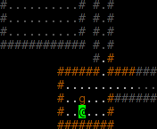

# Welcome to RogueBasin

## What is a Roguelike?

One does not simply ask "What is a Roguelike".

The term "roguelike" is still growing in popularity to describe any game with procedural content generation, or punishing difficulty, it is important to note that roguebasin is meant to serve as a repository of knowledge mostly for **Traditional Roguelikes**.

## What is a Traditional Roguelike?

A traditional Roguelike is usually described as a computer game with a strong focus on intricate gameplay and replayability, where the player has an indefinite amount of time in which to make a move, making gameplay comparable more to chess than to reflex-based games like first-person shooters, and where the game provides new content and challenges on every run, using procedural content generation techniques.

There are many other factors one may consider as relevant for traditional roguelikes, including them having an abstract world representation using characters or simple sprites, as opposed to detailed graphics, requiring the player's imagination to come into play (gameplay is more like reading a book than watching a movie). Modern traditional roguelikes often shun this aspect, in favor of accessibility for less hardcore players.

Of course, the best way to understand what Roguelikes are is to download and play one.  
[--more--](article/development/fundamentals/what_a_roguelike_is.md)

## Roguelikes

Many Roguelikes are freely available online. The most influential ones from the 00's decade are known as the Major Roguelikes:  
[ADOM](game/adom.md) | [Angband](game/angband.md) | [Crawl](game/linleys_dungeon_crawl.md) | [NetHack](game/nethack.md) | [ToME](game/tome.md)

Before their rise in popularity in the late 80s and 90s, the genre was dominated by the Major Classic Roguelikes:  
[Rogue](game/rogue.md) | [Hack](game/hack.md) | [Moria](game/moria.md) | [Larn](game/larn.md) | [Omega](game/omega.md)

Since the control systems of these Roguelikes are geared towards "expert" players, the novice player may be interested in trying a 'lighter' game like some of the [coffeebreak roguelikes](category/coffeebreak_roguelikes.md) or just dive in at the deep end and find a [roguelike game](category/roguelike_games.md) to suit you.

## Roguelike Community

There are several other important places in the roguelike community that you should consider visiting:

* [roguelikes discord](https://discord.gg/Hq8wPcs) - Currently the most active online discussion channel for roguelikes
* [roguelikes subreddit](https://www.reddit.com/r/roguelikes/) - Currently the most active async discussion channel for roguelikes
* [Angband.oook.cz](http://angband.oook.cz/) A very active website about Angband and variants.
* [Temple of the Roguelike Forum](https://forums.roguetemple.com/index.php) - A forum for the roguelike community which used to be very active but still may be worth checking.
